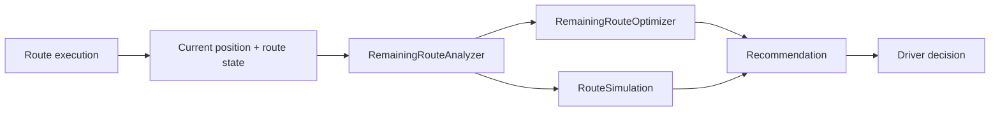

# Route AI Runtime Architecture

Sprint AI-2 adds dynamic route intelligence for the execution phase. The runtime remains fully offline and deterministic.

## Runtime Flow

The driver always decides. Runtime intelligence never silently changes route order.

## Module Layout

- `LockedStopsManager.ts`: partitions completed, skipped, remaining, locked, and movable stops.
- `RemainingRouteAnalyzer.ts`: calculates remaining distance, duration, cluster quality, backtracking, and potential savings.
- `RemainingRouteOptimizer.ts`: optimizes only movable remaining stops and returns a recommendation.
- `OptimizationReasonEngine.ts`: explains why a recommendation exists and estimates confidence.
- `RouteSimulation.ts`: compares Current, Fastest, Shortest, Balanced, and Cluster strategies.
- `OptimizationSession.ts`: orchestration snapshot plus future provider interfaces.

## Locked Stops

Supported lock reasons:

- User Locked
- Priority Delivery
- Business Hours
- Customer Request
- Future Appointment

Locked stops remain in their current remaining-route positions. Completed and skipped stops are excluded from remaining analysis and are never moved.

## Recommendation Contract

Recommendations are proposals only. A recommendation includes:

- Proposed remaining stop ids
- First detected move
- Reason
- Estimated savings in minutes and kilometers
- Confidence
- Driver action surface: Accept Recommendation, Ignore, Preview Changes

No runtime function writes to `RouteContext`.

## Simulation Engine

`simulateRemainingRouteStrategies` compares:

- Current
- Fastest
- Shortest
- Balanced
- Cluster

Each strategy returns distance, duration, savings, confidence, and stop ids. The winner is the highest estimated time savings with confidence as the tie-breaker.

## Extension Points

Interfaces only, no implementation in this sprint:

- Traffic Provider
- Weather Provider
- Road Events Provider
- Parking Difficulty Provider
- Learning Engine
- Voice Assistant

Future AI providers can consume the same runtime snapshot without replacing the local optimizer.

## Offline Guarantee

The runtime does not call OpenAI, Gemini, Claude, traffic services, weather services, maps APIs, or paid APIs. Distance estimates use existing local coordinate and address heuristics.

