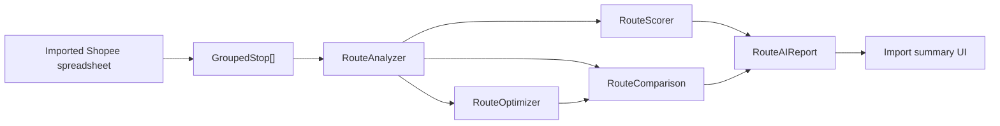

# Route AI Architecture

Sprint AI-1 adds the foundation for the Zerei Rotas AI Route Engine. The engine is deterministic, offline-first, and provider-agnostic.

## Current Scope

- No external AI model integration.
- No OpenAI, Gemini, Claude, traffic, weather, or paid API calls.
- Local route analysis, scoring, comparison, and deterministic optimization.
- Optional route report stored on `RouteData.routeAIReport` after spreadsheet import.

## Module Layout

- `lib/route-ai/OptimizationTypes.ts`: shared interfaces, strategy ids, provider contract, and report types.
- `lib/route-ai/RouteAnalyzer.ts`: distance, duration, clusters, bottlenecks, duplicate streets, and duplicate neighborhoods.
- `lib/route-ai/RouteOptimizer.ts`: deterministic local optimizer and strategy abstraction.
- `lib/route-ai/RouteComparison.ts`: original versus optimized savings.
- `lib/route-ai/RouteScorer.ts`: 0-100 route score with explanatory factors.
- `lib/route-ai/index.ts`: public orchestration entry point.

## Pipeline

## Optimization

Implemented strategies:

- `balanced`
- `fastest`
- `shortest-distance`

Future strategy ids are already modeled:

- `traffic-aware`
- `driver-preference`
- `historical-learning`

The optimizer groups by area signals, sorts deterministically, then applies a bounded 2-opt improvement pass. This keeps behavior predictable and fast for around 200 stops.

## Future AI Hooks

`IRouteOptimizationProvider` is the provider boundary. Future providers can be added behind this interface:

- Local Optimizer
- OpenAI
- Gemini
- Claude
- Offline ML

The app must continue calling provider interfaces or orchestration functions rather than directly depending on a specific AI provider.

## UI Surface

After import, the summary screen displays:

- Original Distance
- Optimized Distance
- Estimated Time Saved
- Estimated Fuel Saved
- Confidence
- Optimization Score
- Recommendation: `Use Optimized Route` or `Keep Original Route`

This sprint does not reorder the live route automatically. It exposes the computed analysis while preserving existing route behavior.

