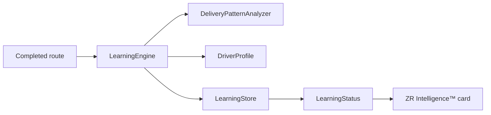

# ZR Learning Engine™

Sprint AI-3 introduces the first offline ZR Learning Engine™. It learns from completed delivery behavior and produces advisory status and future strategy recommendations. It never changes route behavior automatically.

## Architecture

## Stored Metrics

Stored locally under `zerei_route_learning`:

- Routes analyzed
- Stops analyzed
- Completed and skipped stops analyzed
- Average stop duration
- Average apartment duration
- Average house duration
- Average walking distance placeholder
- Preferred optimization strategy
- Average route completion speed
- Average pause duration placeholder
- Average packages per stop
- Average delivery success rate
- Delivery category aggregates
- Strategy recommendation accept/ignore events

## Learning Categories

- Residential
- Commercial
- Apartments
- Condos
- Shopping Centers
- Industrial Areas
- Unknown

## Learning Sources

Implemented now:

- Completed routes
- Completed stops
- Skipped stops
- Strategy suggested by the route AI report

Prepared event model:

- Manual reordering
- Accepted AI recommendations
- Ignored AI recommendations
- Locked stops
- Navigation deviations

## Privacy Model

Learning is anonymous and local. No personally identifiable learning is stored intentionally. No telemetry, uploads, external APIs, cloud ML, OpenAI, Gemini, or Claude are used.

Drivers can:

- Clear learning history through `clearLearningHistory`
- Disable or re-enable learning through `setLearningEnabled`

## Future Extension Points

Interfaces are prepared for:

- Encrypted cloud backup
- Fleet learning
- Traffic
- Voice
- Weather
- Founder analytics

These are interfaces only. No cloud sync or fleet implementation exists in this sprint.

